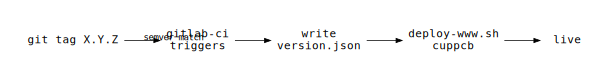

# cupPCB — CI/CD

## Release process

Tag main with a semver version (no `v` prefix). The pipeline does the rest.

```
git tag 4.2.2
git push origin 4.2.2
```



## Steps

1. **tag** — push a tag matching `X.Y.Z` (digits only, no prefix)
2. **ci triggers** — GitLab runner `proxy.uncloseai.com` picks up the job
3. **version.json** — CI writes `{"version":"X.Y.Z"}` before deploy
4. **deploy** — `sudo /usr/local/bin/deploy-www.sh cuppcb .` runs on the proxy node
5. **live** — site is up at the new version

## Runner notes

- Runner: `proxy.uncloseai.com` (ID 28), `ref_protected`, shell executor
- All tags are protected (`*` wildcard) — required for the `ref_protected` runner to pick up jobs
- Runner re-registration resets tags in GitLab; re-add `proxy.uncloseai.com` tag via API or UI if deploy stalls

## Troubleshooting a stuck deploy

Job stuck in Pending → check in order:

1. Runner online? `systemctl status gitlab-runner` on `proxy.uncloseai.com`
2. Runner has tag? `GET /api/v4/runners/28` — `tag_list` must include `proxy.uncloseai.com`
3. Tag protected? `GET /api/v4/projects/.../protected_tags` — wildcard `*` must exist
4. Concurrency headroom? `concurrent = 4` in `/etc/gitlab-runner/config.toml`
