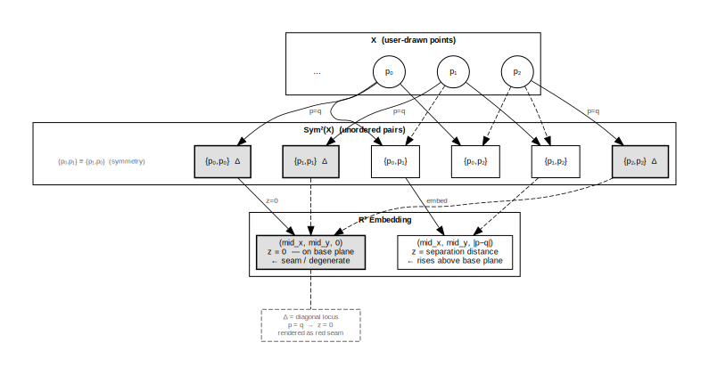
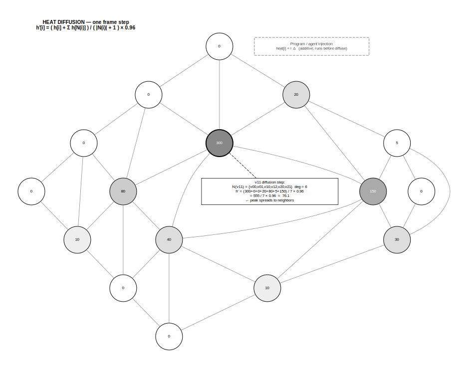
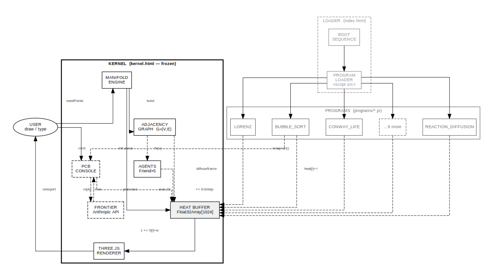
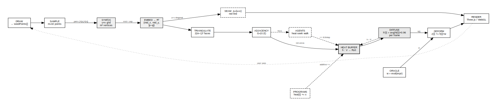

# SEW: Symmetric Embedding Workbench
## A Manifold Simulator Kernel from First Principles

**ARK_ID:** 1.0.2.10
**Revision:** 0.1
**Status:** WORKING DRAFT

---

## Abstract

SEW (Symmetric Embedding Workbench) is a browser-resident manifold simulator built on three
primitives: a symmetric product space construction, a heat diffusion signal model, and a
frozen kernel with an open program injection interface. This paper derives each layer from
first principles, establishes the kernel stability invariant, and specifies the program
injection protocol. Dot diagrams formalize the data flow and architectural boundaries.

---

## 1. Motivation

Most interactive geometry tools begin with a fixed mesh and let the user deform it.
SEW inverts this. The user draws arbitrary points in a plane. The workbench constructs
a canonical higher-dimensional manifold from those points using the symmetric product
construction. Programs then run on that manifold — injecting signals, reading topology,
reshaping the surface — without knowing how it was built.

The result is a general-purpose signal substrate. Any program that can write to a heat
buffer indexed by vertex position can participate in the manifold's dynamics. The geometry
becomes a shared memory between concurrent programs and the user.

---

## 2. First Principles

### 2.1 Points and Pairs

Begin with a finite set X of points in the plane, drawn by the user. X has no canonical
ordering. The workbench must construct something meaningful from X without privileging
any particular ordering of its elements.

The natural object is the set of unordered pairs:

```
Sym²(X) = { {p, q} : p, q ∈ X }
```

This is the symmetric product of X with itself. It has |X|² elements if we allow p = q
(the diagonal), or |X|(|X|-1)/2 + |X| elements counting the diagonal once.

The diagonal Δ ⊂ Sym²(X) is the locus where p = q:

```
Δ = { {p, p} : p ∈ X }
```

Δ is geometrically degenerate — both points in the pair coincide. It is rendered as the
red seam line in the viewport. Everything off the diagonal is a genuine two-point
configuration.

### 2.2 The Embedding

To embed Sym²(X) into R³ we need three scalar functions of a pair {p, q}:

```
x({p,q}) = (px + qx) / 2       — midpoint x
y({p,q}) = (py + qy) / 2       — midpoint y
z({p,q}) = |p - q|              — separation distance
```

The midpoint coordinates place the pair in the plane of X. The separation distance lifts
it above that plane proportionally to how far apart the two points are. Diagonal points
(p = q) land at z = 0, the base plane. Off-diagonal pairs rise above it.

This embedding is symmetric by construction: swapping p and q produces the same point
in R³. It is also continuous: nearby pairs in X map to nearby points in the embedding.

### 2.3 Discretization

With a sampled set of m points from X (m = 32 in the current implementation), the
embedding produces an m × m grid of vertices. Vertex (u, v) encodes the pair
{X[u], X[v]}.

Triangulation: connect (u,v)→(u+1,v)→(u,v+1) and (u+1,v)→(u+1,v+1)→(u,v+1)
for all u, v in [0, m-1). This produces 2(m-1)² triangles.

The resulting mesh is the concrete manifold SEW operates on.

### 2.4 The Adjacency Graph

From the triangle index buffer, derive a vertex adjacency graph G = (V, E):

```
V = { (u,v) : u,v ∈ [0,m) }     |V| = m²
E = { {a,b} : a,b share a triangle edge }
```

Each vertex has degree ≤ 6 (four-connected grid, triangulated). Deduplicate with
Set to avoid double-counting. G is the substrate for heat diffusion and agent traversal.



---

## 3. The Heat Model

### 3.1 Heat as Signal

Heat is a scalar field h: V → R≥0 defined on the manifold vertices. It serves as the
universal communication channel between programs and the rendering engine.

The renderer reads heat each frame and adds h[i] × w to the z-coordinate of vertex i,
where w is a time-varying oracle expression. High heat lifts a vertex; zero heat leaves
it at rest.

### 3.2 Diffusion

Each frame, heat diffuses across the adjacency graph:

```
h'[i] = ( h[i] + Σ_{j ∈ N(i)} h[j] ) / ( |N(i)| + 1 ) × decay
```

where N(i) is the neighbor set of vertex i and decay = 0.96. This is a single step of
the graph Laplacian heat equation. It smooths local concentrations, propagates signals
spatially, and ensures injected heat eventually dissipates without continuous input.

The discrete Laplacian here is the normalized graph Laplacian:

```
L_norm[i] = h[i] - ( Σ_{j ∈ N(i)} h[j] ) / |N(i)|
```

Diffusion is equivalent to h' = h - α × L_norm × h for small α.

### 3.3 Injection

Programs inject heat by writing directly to the heat buffer:

```js
heat[i] += amount;                        // additive — stacks with other programs
heat[i] = value;                          // absolute — overrides
heat[i] = Math.min(heat[i] + amount, cap); // capped additive
```

Additive injection is preferred. It composes correctly when multiple programs run
simultaneously — each program's signal adds to the manifold without needing to
coordinate with others.



---

## 4. Agent Traversal

Agents (Friends) are particles that walk the adjacency graph G using a heat-seeking
heuristic:

```
at each step:
  with probability 0.15: move to a random neighbor   (exploration)
  with probability 0.85: move to the hottest neighbor (exploitation)
  inject heat[current] += 8.0
```

This is a stochastic gradient ascent on the heat field with exploration noise. Agents
cluster at heat maxima, reinforce them by injecting more heat, and occasionally escape
to explore cold regions. The system self-organizes: wherever a program concentrates heat,
agents converge and amplify.

---

## 5. The Kernel Architecture

### 5.1 Kernel Stability Invariant

The kernel (kernel.html) is a frozen artifact. Its md5 hash is recorded at deployment
and must not change between deployments. No program, script, or operator may modify it.

**Invariant:** md5(kernel.html) is constant for the lifetime of a kernel version.

```
md5(kernel.html) = 15e81f3b8064fb16ebb94f0626c4360d
```

When the kernel must change (new primitive, breaking fix), the version number increments
and a new kernel.html is issued. Old programs remain compatible or are explicitly ported.

This invariant enables:

- Programs to assume a stable global scope
- Operators to audit exactly what the kernel does
- The workbench to be reproduced from kernel.html alone on any machine

### 5.2 Kernel Globals

Programs have read/write access to the following kernel globals:

| Symbol              | Type             | Description                            |
|---------------------|------------------|----------------------------------------|
| `scene`             | THREE.Scene      | Three.js scene graph                   |
| `camera`            | THREE.Camera     | Perspective camera                     |
| `heat`              | Float32Array     | Heat buffer, length = m² (1024)        |
| `adjacency`         | Array\<Array\>   | Vertex neighbor lists                  |
| `meshVertices`      | Array\<number\>  | Current vertex positions (flat xyz)    |
| `originalVertices`  | Array\<number\>  | Rest-state vertex positions            |
| `seedPoints`        | Array\<{x,y}\>   | User-drawn input points                |
| `friendList`        | Array\<Friend\>  | Active agent instances                 |
| `pcb`               | PCBInterpreter   | Console — pcb.log() / pcb.run()        |
| `flickerRate`       | number           | Material opacity oscillation rate      |
| `wobbleBase`        | number           | Per-vertex position noise amplitude    |
| `tick`              | number           | Frame counter, increments each RAF     |
| `buildManifold`     | function         | Rebuild mesh from seedPoints array     |

### 5.3 The PCB Console

The POCKET_CUP_BOX_CONSOLE is a JavaScript REPL wired to the kernel scope. It detects
code (patterns containing `= . (`) and evals directly. Plain text with FRONTIER open
routes to the Anthropic API. Programs extend it by wrapping `pcb.run`:

```js
const _orig = pcb.run.bind(pcb);
pcb.run = function(src) {
    if (src.trim() === 'my.cmd') { /* handle */ return; }
    _orig(src);   // pass through to previous handler
};
```

This forms a chain of responsibility. Programs wrap in load order. Each handler either
consumes the command or delegates. The kernel's base handler is always at the bottom.



---

## 6. The Program Injection Model

### 6.1 Injection Protocol

Programs are plain JavaScript files loaded as `<script src>` tags in `index.html` after
the kernel script. They execute synchronously in document order, in the same window
scope as the kernel. No module system, no sandbox, no message passing.

```html
<!-- PROGRAM LOADER -->
<script src="programs/bubble-sort.js"></script>
<script src="programs/reaction-diffusion.js"></script>
<!-- add programs here -->
```

### 6.2 Program Interface

A conforming program must:

1. Execute inside an IIFE `(function(){ ... })()` to avoid polluting global scope
2. Insert exactly one `.module` div into `#sidebar` via `insertBefore(mod, firstChild)`
3. Wrap `pcb.run` if registering PCB commands, always calling `_orig` for unknown input
4. Call `pcb.log('PGM: NAME loaded. cmds: ...')` on successful initialization
5. Clean up timers and animation loops when stopped (no leak on stop/reset)

### 6.3 Sidebar Module Template

```js
const mod = document.createElement('div');
mod.className = 'module';
mod.id = 'pgm-myprogram';
mod.innerHTML = '<h3>MY_PROGRAM</h3><!-- controls -->';
document.getElementById('sidebar')
    .insertBefore(mod, document.getElementById('sidebar').firstChild);
```

Kernel CSS classes available: `.module`, `.btn`, `.btn-pcb`, `.matrix-grid`, `.m-val`.

### 6.4 Heat Contract

Programs that write to `heat` must:

- Check `heat.length > 0` before writing (manifold may not be built yet)
- Prefer additive writes (`heat[i] += x`) over absolute writes
- Respect `heat.length === N` where N = 1024 for the current m = 32 kernel
- Not hold references to old heat arrays — diffusion may replace the buffer each frame



---

## 7. The Boot Sequence

On page load, `index.html` runs a timed boot readout before revealing the workbench.
The sequence verifies the visual expectation that loading is intentional and measurable,
not accidental latency.

```
ARK_BIOS v1.0.2.10
KERNEL HASH .............. VERIFIED
THREE.JS r128 ............ OK
ORBIT_CONTROLS ........... OK
MANIFOLD ENGINE .......... READY
PGM BUBBLE_SORT .......... OK
PGM REACTION_DIFFUSION ... OK
PGM LORENZ_ATTRACTOR ..... OK
PGM CONWAY_LIFE .......... OK
PGM WAVE_INTERFERENCE .... OK
PGM FIRE_SIM ............. OK
PGM LISSAJOUS ............ OK
PGM CHAOS_GAME ........... OK
PGM GRAVITY .............. OK
PGM AUDIO_REACTIVE ....... OK
PGM FLOW_FIELD ........... OK
PGM LANGTON_ANT .......... OK
ALL SYSTEMS .............. NOMINAL
ARK READY _
```

The gold progress bar tracks cumulative program count. On completion the overlay
dissolves and the workbench is revealed.

---

## 8. Installed Programs

| Program              | PCB Commands                          | Description                                       |
|----------------------|---------------------------------------|---------------------------------------------------|
| `bubble-sort`        | `sort.run` `sort.heat` `sort.reset`   | Sorts random array; `sort.heat` runs on manifold  |
| `reaction-diffusion` | `rd.spots` `rd.stripes` `rd.mitosis`  | Gray-Scott model — organic pattern emergence      |
| `lorenz`             | `lorenz.start` `lorenz.chaos`         | Lorenz attractor traces heat into nearest vertex  |
| `life`               | `life.start` `life.glider` `life.gun` | Conway's Life — alive cells inject heat           |
| `wave`               | `wave.start` `wave.chaos`             | Interference moiré from multiple point sources    |
| `fire`               | `fire.start` `fire.inferno`           | Fire simulation — manifold becomes flame          |
| `lissajous`          | `liss.go` `liss.spin` `liss.flower`   | Parametric curves auto-reify manifold geometry    |
| `chaos`              | `chaos.sierpinski` `chaos.fern`       | IFS chaos game — fractals grow into manifold      |
| `gravity`            | `gravity.start` `gravity.collapse`    | N-body orbits — potential wells dimple the mesh   |
| `audio`              | `audio.mic` `audio.synth`             | FFT → heat, manifold dances to sound              |
| `flow`               | `flow.start` `flow.storm`             | Noise flow field, particle streams leave trails   |
| `langton`            | `ant.start` `ant.turbo` `ant.ants 4`  | Langton's ant — emergent highways after ~10k steps|

---

## 9. Extension Points

The current kernel exposes extension through heat and `pcb.run`. Future versions may
expose:

- **Geometry hooks** — programs that modify `originalVertices` to reshape the rest state
- **Agent hooks** — custom Friend subclasses with different traversal strategies
- **Oracle hooks** — programs that replace the oracle expression with live functions
- **Frontier hooks** — intercept/augment Claude API calls before they execute

These are not in the current kernel. They are listed here to constrain their future
design: any extension must preserve the kernel stability invariant.

---

## 10. Conclusion

SEW establishes a manifold as a programmable signal medium. The Sym²(X) construction
gives it mathematical grounding: the mesh is not arbitrary but derives canonically from
the user's drawn points. Heat diffusion gives it physical grounding: signals propagate
and decay by the graph Laplacian. The program injection model gives it operational
grounding: programs are isolated, composable, and additive.

The kernel is frozen. Programs are open. The heat buffer is shared.

That is the whole system.

---

*unworkbench.com — permacomputer infrastructure — CC0*
